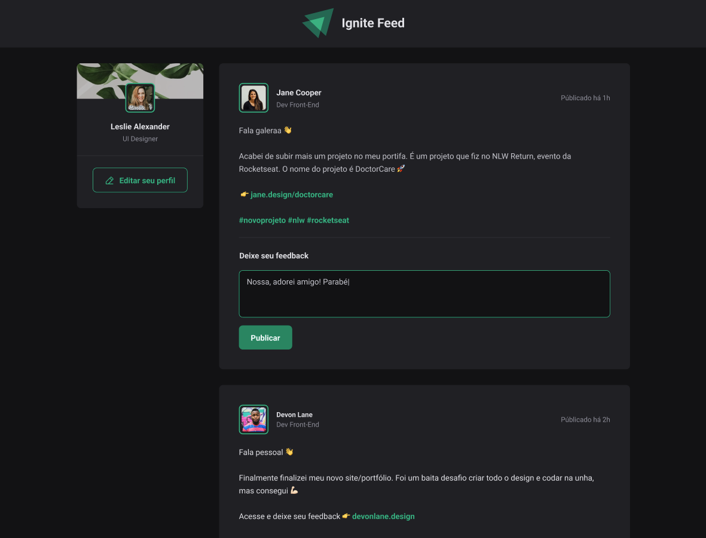

# Ignite Feed 

Projeto simples em React para treinar conceitos básicos de `componentes` e `propriedades`  
> Para ver o projeto rodando você pode acessar este [Link](link.com.br).

---

Aplicação WEB:

  

---
## Funcionalidades

- [x] Exemplo 1
- [x] Exemplo 2
- [x] Exemplo 3

---

## Tecnologias

- [`React`](https://pt-br.reactjs.org/)